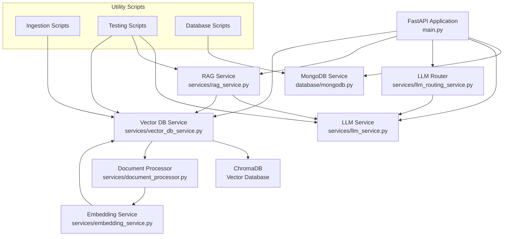

# Yijiu AI Business Advisor

This document outlines the engineering approach for building Yijiu's AI-powered business advisory system. The system analyzes small business profiles (e.g., noodle shops, BBQ restaurants, liquor stores, convenience stores, tutoring centers) and generates detailed improvement recommendations based on Yijiu's proprietary business consulting knowledge.

The system consists of three main components:
- **Frontend**: React web application for business profile input and report visualization
- **Backend**: FastAPI server integrating LLM technology with Yijiu's business expertise
- **Docs**: Documentation of feature specs

Key Features:
- Business type-specific analysis and recommendations
- Integration of Yijiu's proprietary consulting frameworks
- Customized deep-dive reports focusing on core specific business's challenges

---

## Structure
- `/frontend` - Frontend application
- `/backend` - Backend services
- `/docs` - Project documentation

### **0. Quick Start**

To start all services (Database, Backend Server, and Frontend):
```bash
chmod +x start.sh  # Only needed first time
./start.sh
```

This will start:
- MongoDB database on port 27017
- FastAPI backend on port 8000
- React frontend on port 3000


### **1. Frontend - React Web Application**

#### 1.1 **Overview**
The frontend is a modern React application that provides an intuitive interface for business owners to interact with the AI advisor. It features a chat-based interface with conversation history management, business case templates.

#### 1.2 **Technology Stack**
- **React**: Core UI library
- **Webpack**: Module bundling
- **Babel**: JavaScript transpilation
- **CSS Modules**: Component-scoped styling
- **Axios**: API communication

#### 1.3 **Project Structure**
```plaintext
frontend/
├── public/                  # Static assets
│   └── index.html           # HTML entry point
├── src/
│   ├── components/          # React components
│   │   ├── ChatWindow.jsx   # Chat message display
│   │   ├── ConversationList.jsx # Sidebar conversation history
│   │   ├── Header.jsx       # Application header
│   │   ├── MessageInput.jsx # User input component
│   │   ├── ReportViewer.jsx # Business report display
│   │   └── SuggestedPrompts.jsx # Business case templates
│   ├── services/
│   │   └── api.js           # API client for backend communication
│   ├── styles/              # CSS styles
│   │   ├── App.css          # Main application styles
│   │   ├── ChatWindow.css   # Chat interface styles
│   │   ├── Header.css       # Header styles
│   │   ├── MessageInput.css # Input field styles
│   │   ├── Sidebar.css      # Conversation list styles
│   │   ├── SuggestedPrompts.module.css # Business case template styles
│   │   ├── utils.css        # Utility classes
│   │   └── variables.css    # CSS variables for theming
│   ├── App.jsx              # Main application component
│   └── index.jsx            # Application entry point
├── .babelrc                 # Babel configuration
├── package.json             # Dependencies and scripts
└── webpack.config.js        # Webpack configuration
```

#### 1.4 **Key Features**

##### Chat Interface
The application provides a modern chat interface where users can:
- Send messages to the AI advisor
- View AI-generated responses with Markdown support
- See typing indicators when the AI is processing

##### Conversation Management
- Save and retrieve conversation history
- Create new conversations
- Delete existing conversations
- View a list of past conversations with previews

##### Business Case Templates
The application offers pre-configured business case templates for common scenarios:
- Wenzhou Noodle Restaurant facing modernization challenges
- Zhengzhou BBQ Restaurant with operational issues
- Baoding Art Education Center adapting to market changes

Each template includes:
- Business type and location
- Key challenges
- Financial metrics
- Structured format for AI analysis

##### Responsive Design
- Glassmorphism UI with blur effects and transparency
- Responsive layout that works on desktop and mobile devices
- Collapsible sidebar for conversation history
- Dark theme with accent colors

#### 1.5 **API Integration**
The frontend communicates with the backend through a RESTful API:
- `/chat` endpoint for sending messages and receiving responses
- `/conversations` endpoints for managing conversation history
- `/analyze` endpoint for detailed business case analysis

#### 1.6 **Running Locally**

1. **Install Dependencies**:
   ```bash
   cd frontend
   npm install
   ```

2. **Start Development Server**:
   ```bash
   npm start
   ```
   This will launch the application at `http://localhost:3000`

3. **Build for Production**:
   ```bash
   npm run build
   ```
   This creates optimized files in the `dist` directory

---
### **2. Backend - FastAPI Server**
# Backend Documentation

## Architecture Overview



## Component Walkthrough

### 1. Main Application (`main.py`)

The central FastAPI application that defines API routes and manages request handling. Key endpoints include:

- `/conversations`: Create, retrieve, and delete conversation records
- `/chat`: Handle chat interactions with the LLM, optionally using RAG
- `/vector-search`: Perform semantic search on embedded documents

### 2. Database (`database/`)

Contains MongoDB integration for storing conversation history.

- **mongodb.py**: Provides an asynchronous MongoDB client with methods for CRUD operations on conversations

### 3. Models (`models/`)

Defines data structures used throughout the application.

- **conversation.py**: Contains `Message` and `Conversation` Pydantic models for structured data handling

### 4. Services (`services/`)

Core business logic of the application, divided into specialized services:

- **rag_service.py**: Manages Retrieval-Augmented Generation functionality
  - Retrieves relevant context from vector database based on user queries
  - Formats retrieved context for LLM prompts
  - Generates responses by combining context with user queries
  - Extracts and organizes source information for citations

- **vector_db_service.py**: Manages interactions with the vector database (ChromaDB)
  - Provides methods to add, retrieve, and query document embeddings
  - Handles document processing and storage
  - Includes utilities for managing database collections and status
  - Implements error handling for vector database operations

- **embedding_service.py**: Handles text embeddings for semantic search
  - Provides methods to encode text/queries into vector embeddings

- **document_processor.py**: Processes documents for RAG
  - Includes parsers for different document types
  - Implements chunking strategies (Hierarchical and Sliding Window)
  - Prepares documents for vector storage

- **llm_service.py**: Interfaces with OpenAI's language models
  - Manages API communication with different models (GPT-4o, GPT-o3-mini, etc.)
  - Formats prompts and processes responses

- **llm_routing_service.py**: Routes user queries to appropriate processing pipelines
  - Analyzes queries to determine best handling approach

### 5. Vector Database (`chroma_db/`)

Stores document embeddings for semantic search capabilities. Managed primarily through the vector_db_service.py interface.

### 6. Scripts (`scripts/`)

Utility scripts for various operational tasks:

- **ingestWebsiteToChromaDb.py**: Scrapes and indexes website content into ChromaDB
- **ingest_restaurant_docs.py**: Processes restaurant-specific documents for RAG
- **check_db_status.py**: Monitors and manages database status
- **test_retrieval.py**, **test_rag.py**, **simple_rag_test.py**: Testing scripts for RAG functionality
- **rag_to_file.py**: Utility for exporting RAG results

### 7. Environment and Dependencies

- **requirements.txt**: Lists all Python dependencies including:
  - FastAPI and Uvicorn for API framework
  - OpenAI for LLM integration
  - ChromaDB for vector storage
  - MongoDB tools (motor, pymongo) for database access
  - Sentence-transformers for embedding generation

## Data Flow

1. User requests come in through FastAPI endpoints in `main.py`
2. Depending on the request type:
   - Chat requests are processed by the LLM service
   - If RAG is enabled, the RAG service:
     - Retrieves relevant context via the vector DB service
     - Formats the context with the user query
     - Sends the combined prompt to the LLM service for response generation
   - Conversation history is stored/retrieved from MongoDB
3. For document ingestion:
   - Documents are processed by the document processor
   - Text is chunked according to strategy
   - Chunks are embedded and stored via the vector DB service into ChromaDB

## Conversational Flow: Business Case Analysis

The system supports multi-turn conversations for business case analysis with the following flow:

1. **Business Outline Request**
   - User asks for a business case outline with specific challenges and metrics
   - System routes to `BUSINESS_ANALYSIS_OUTLINE_ROUTE`
   - System generates a structured outline with analysis and recommendations

2. **Report Generation Request**
   - User asks to generate a full report based on the outline
   - LLM router recognizes this as a follow-up to a business outline
   - System routes to `BUSINESS_CASE_RAG_ROUTE`
   - RAG service retrieves relevant business knowledge
   - System generates a comprehensive report using the outline and retrieved knowledge

This approach allows users to first get a structured outline and then request a detailed report, with the system maintaining context throughout the conversation.

## Development Setup

The project uses a virtual environment (`venv/`) for dependency isolation. Before installing packages, always check if the virtualenv is active.

To install dependencies:
```bash
# Activate virtual environment
source venv/bin/activate  # On Unix/macOS
# or
.\venv\Scripts\activate  # On Windows

# Install requirements
pip install -r requirements.txt
```

4. **API Documentation**:
   FastAPI automatically generates interactive API documentation:
   - Swagger UI: `http://localhost:8000/docs`
   - ReDoc: `http://localhost:8000/redoc`
