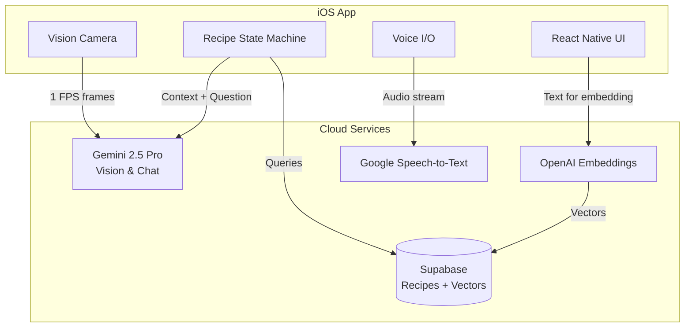

# Miso AI - Real-Time Multimodal Cooking Assistant

This document outlines the engineering approach for building Miso AI, an iOS-first intelligent cooking assistant that uses real-time computer vision, voice interaction, and AI to provide hands-free, adaptive cooking guidance. The system watches your cooking through the camera, listens to your questions, and adapts recipes based on available ingredients and cookware.

The system consists of three main components:
- **Frontend**: React Native (Expo) iOS application with camera vision and voice interface
- **Backend**: Cloud AI services (Gemini 2.5 Pro) and Supabase for recipe storage and RAG
- **Docs**: Product design and engineering feature documentation

Key Features:
- Real-time ingredient and cookware recognition at ~1 FPS
- Step-by-step audio guidance with AR overlays
- Dynamic recipe adaptation for missing ingredients or equipment
- Hands-free voice control with wake-word detection
- Built-in recipe library and user recipe import

---

## Structure
- `/app` - Expo Router screens and navigation
- `/src` - Core application logic and services
- `/docs` - Project documentation
- `/assets` - Fonts, images, and static resources

### **0. Quick Start**

To start the development server:
```bash
# Install dependencies
npm install

# Start Expo development server
npm start

# Run on iOS Simulator
npm run ios
```

This will start:
- Expo development server
- iOS Simulator with hot reload enabled
- TypeScript compilation in watch mode

### **1. Frontend - React Native + Expo Application**

#### 1.1 **Overview**
The frontend is a React Native application built with Expo that provides an immersive cooking experience. It features real-time camera analysis, voice interaction, AR overlays for ingredient highlighting, and adaptive recipe guidance based on available tools and ingredients.

#### 1.2 **Technology Stack**
- **React Native 0.79.4**: Cross-platform mobile framework
- **Expo SDK ~53.0**: Managed workflow for rapid development
- **TypeScript**: Type safety and better developer experience
- **Expo Router**: File-based navigation
- **React Native Vision Camera**: High-performance camera access
- **Supabase Client**: Backend integration for recipes and RAG

#### 1.3 **Project Structure**
```plaintext
miso-ai/
├── app/                        # Expo Router screens
│   ├── _layout.tsx            # Root layout with fonts and global styles
│   ├── index.tsx              # Home screen (recipe browser)
│   └── session.tsx            # Cooking session with camera
├── src/
│   ├── components/            # Reusable UI components
│   │   └── ThemedText.tsx     # Text with consistent styling
│   ├── features/              # Feature-specific modules
│   │   ├── cooking-session/   # Core cooking logic
│   │   │   ├── CameraFeed.tsx
│   │   │   ├── SessionOverlay.tsx
│   │   │   └── fsm/          # State machine for recipe flow
│   │   ├── cookware-vision/   # Equipment detection
│   │   └── recipe-browser/    # Recipe selection UI
│   ├── services/              # External service integrations
│   │   ├── gemini.ts         # Gemini AI vision & chat
│   │   ├── supabase.ts       # Recipe database & RAG queries
│   │   ├── openai.ts         # Text embeddings
│   │   └── voice/            # Voice I/O services
│   │       ├── wakeWord.ts   # "Chef" wake word detection
│   │       ├── sttStream.ts  # Speech-to-text
│   │       └── tts.ts        # Text-to-speech
│   ├── types/                # TypeScript interfaces
│   │   └── recipe.ts         # Recipe data structures
│   └── data/                 # Sample data
│       └── recipes.ts        # Built-in recipes
├── assets/                   # Static resources
└── app.config.ts            # Expo configuration
```

#### 1.4 **Key Features**

##### Real-Time Vision Analysis
- Camera processes frames at ~1 FPS using Gemini 2.5 Pro
- Identifies ingredients, cookware, and cooking actions
- Provides visual feedback through AR overlays
- Monitors cooking progress and alerts for issues

##### Adaptive Recipe Guidance
- Automatically adjusts instructions for missing ingredients
- Suggests alternative cooking methods for unavailable equipment
- Uses RAG to retrieve substitution knowledge from Supabase
- Maintains context throughout the cooking session

##### Voice Interaction
- Wake-word activation ("Chef") using Picovoice Porcupine
- Natural language understanding for questions and commands
- Continuous audio instructions via text-to-speech
- Hands-free control throughout cooking

##### Recipe Management
- Built-in curated recipe library stored in Supabase
- Import recipes from text or PDF
- Semantic search across recipes using vector embeddings
- Personalized recommendations based on available ingredients

#### 1.5 **Running Locally**

1. **Prerequisites**:
   - Node.js 18+ and npm
   - Xcode 14+ with iOS Simulator
   - Expo CLI (`npm install -g expo-cli`)

2. **Environment Setup**:
   ```bash
   # Copy environment template
   cp .env.example .env
   
   # Add your API keys:
   # GEMINI_API_KEY=your_key_here
   # SUPABASE_URL=your_url_here
   # SUPABASE_ANON_KEY=your_key_here
   # OPENAI_API_KEY=your_key_here
   ```

3. **Development Commands**:
   ```bash
   # Install dependencies
   npm install
   
   # Start development server
   npm start
   
   # Run on iOS
   npm run ios
   
   # Type checking
   npx tsc --noEmit
   
   # Test build
   npx expo export --platform ios --dev
   ```

---

### **2. Backend - Cloud AI Services & Supabase**

## Architecture Overview



## Component Overview

### 1. Gemini 2.5 Pro Integration

Handles both vision analysis and conversational AI:

- **Vision Analysis**: Processes camera frames to identify ingredients, cookware, and cooking states
- **Chat Completions**: Generates contextual responses and adapted instructions based on RAG-retrieved knowledge

### 2. Supabase Backend

Serves as the primary database and vector store:

- **Recipe Storage**: Structured tables for recipes, ingredients, steps, and user profiles
- **Vector Search**: Uses pgvector extension for semantic similarity queries
- **Knowledge Base**: Stores cooking tips, substitution guides, and technique references
- **User Profiles**: Saves preferences, equipment lists, and cooking history

### 3. Voice Processing Pipeline

- **Picovoice Porcupine**: On-device wake word detection
- **Google Cloud Speech-to-Text**: Streaming transcription for commands
- **Expo Speech (TTS)**: System voices for audio instructions

### 4. RAG (Retrieval-Augmented Generation)

Enhances AI responses with grounded knowledge:

1. User query or context → OpenAI Embeddings → Vector
2. Vector similarity search in Supabase → Relevant passages
3. Passages + Context → Gemini Chat → Grounded response
4. Response includes adapted instructions or substitution suggestions

## Data Flow

1. **Session Start**: 
   - User selects recipe → App fetches from Supabase
   - Camera scans for available ingredients/tools
   - System adapts recipe if needed using RAG

2. **During Cooking**:
   - Vision: Camera → Gemini → Ingredient/action detection
   - Voice: Wake word → STT → Command processing
   - Questions: Query → Embedding → RAG search → Gemini → Answer

3. **Adaptation Logic**:
   - Missing ingredient detected → Search substitutions → Suggest alternative
   - Missing equipment → Retrieve alternative methods → Modify instructions

## Development Setup

Currently, the backend services are cloud-based and accessed via API keys. Local development uses the same cloud services with rate limiting for cost control.

### API Endpoints (via Supabase)

- Recipe CRUD operations
- Vector similarity search
- User profile management
- Session history storage

---

## Key Innovations

1. **Real-Time Multimodal Guidance**: Combines vision, voice, and AI to create an interactive cooking experience
2. **Adaptive Recipe System**: Dynamically adjusts recipes based on what you actually have
3. **Privacy-First Design**: Camera analysis happens in real-time without recording
4. **Hands-Free Operation**: Complete voice control means no touching screens with messy hands

## Roadmap

- **v0.8 Beta (Current)**: Core functionality with 50+ built-in recipes
- **v0.9**: Enhanced equipment detection, more substitution options
- **v1.0**: Full recipe import, premium subscription features
- **Future**: Android support, smart appliance integration, social features

## Contributing

This project is currently in private beta. For access or questions, please contact the development team.

## License

Proprietary - All rights reserved