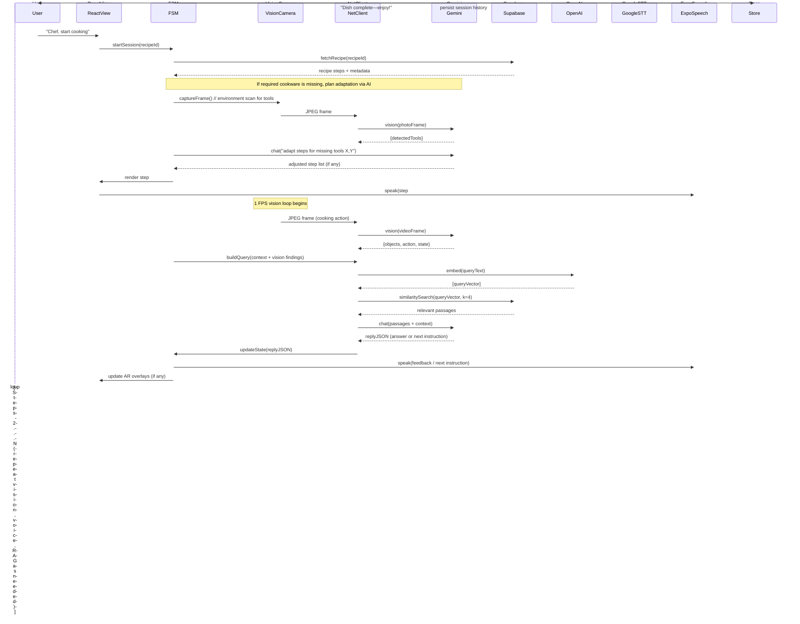

Thanks for the confirmation. I’ll revise the Engineering Feature Document to align with the updated product design: replacing ChromaDB with Supabase vector search, introducing a new `cookware-vision/` module for equipment recognition, and streamlining the RAG logic with equipment context planned for future development. I’ll also reflect the use of Gemini for vision/chat and OpenAI for embeddings.

I’ll get the revised version ready for your review shortly.


# Engineering Feature Document

**Miso AI — iOS Cooking Assistant (React Native + Expo Edition)**
Date: 2025‑06‑23 | Author: (Your Name)

---

## 0  Summary

| Section                                  | Purpose                                            |
| ---------------------------------------- | -------------------------------------------------- |
| **1. Objective**                         | What we are building and why                       |
| **2. Context**                           | Relationship to the Product Design Doc             |
| **3. High‑Level Architecture**           | Text + Mermaid flow & sequence diagrams            |
| **4. Source Layout (Mono‑repo)**         | Folder tree, package targets, responsibilities     |
| **5. Component Responsibilities & APIs** | Public interfaces for each module                  |
| **6. Control Flow**                      | Step‑by‑step interaction during a cooking session  |
| **7. Implementation Roadmap**            | Milestones, tickets, and sequencing                |
| **8. Tech‑Stack Choices**                | Rationale for every framework / service            |
| **9. Risks & Open Questions**            | What still needs definition                        |
| **10. Next‑Step Clarifications**         | Targeted questions for the PM/Design/Backend teams |

---

## 1  Objective

> **Deliver a functional iOS application that turns any modern iPhone into a hands‑free, AI‑powered cooking coach, implemented with React Native + Expo, using Google’s Gemini 2.5 Pro for *1 FPS* visual analysis and multimodal reasoning, with Retrieval‑Augmented Generation (RAG) via a Supabase-hosted knowledge base (Postgres + pgvector), and the OpenAI Embedding API for recipe and document vectors.**

The first public milestone is **v0.8 Beta (October 2025)** with these user‑facing capabilities:

1. Pick a built‑in or imported recipe from a curated library.
2. Position the phone and start a guided session.
3. Receive continuous audio instructions with real‑time camera feedback (≈1 FPS), and control the app via wake‑word voice commands.
4. End the session and view a history log of what was cooked (stored on-device and/or in profile).
5. **Dynamic recipe adaptation:** the AI assistant automatically adjusts instructions for any missing ingredients or cookware (suggesting substitutions and alternative methods via its knowledge base).

---

## 2  Context

* The **Product Design Doc (PDD)** is approved, locking down the features, UX, and monetization strategy.
* This Engineering Feature Document (EFD) translates the PDD’s requirements into a concrete **code structure, module interfaces, and development plan** for a *React Native (Expo)* implementation.
* The scope aligns with the PDD’s decisions: using **Gemini cloud AI (no on-device model training)** and a **single-tier subscription model** for premium features. The backend architecture now leverages **Supabase** (Postgres + storage + vector) for recipe content, embeddings, and user profiles, replacing the previously proposed standalone ChromaDB solution.

---

## 3  High‑Level Architecture

### 3.1 Component Blocks

```mermaid
flowchart TD
    subgraph On‑Device (React Native + Expo)
        AppUI[React Components<br/>(Expo Router)]
        VoiceIO[Voice I/O<br/>(Wake‑Word, STT, TTS)]
        SessionSM[Recipe State Machine<br/>(JS FSM & Adaptation Logic)]
        Camera[VisionCamera @1 FPS]
        NetClient[API Client<br/>(Gemini & Supabase)]
        Store[SQLite / MMKV<br/>Local History Cache]
    end
    subgraph Cloud
        Gemini[Gemini 2.5 Pro<br/>(Vision Analysis + Chat LLM)]
        SupabaseDB[Supabase (Postgres + pgvector)<br/>(Recipes/Profiles/Knowledge)]
        OpenAI[OpenAI Embeddings API<br/>(Text Vectors)]
        Speech[Google STT v3]
    end
    AppUI --dispatch--> SessionSM
    Camera --> NetClient
    VoiceIO --> Speech
    VoiceIO <-- Speech
    NetClient --frames--> Gemini
    NetClient --embed(query)--> OpenAI
    NetClient --query--> SupabaseDB
    Gemini --grounded answer--> NetClient
    NetClient --> SessionSM
    SessionSM --> AppUI & VoiceIO
    Store <-- SessionSM
```

**Key React‑Native bindings**

| Native Capability           | RN Module / Expo Plugin                                    |
| --------------------------- | ---------------------------------------------------------- |
| 1 FPS Video Frames          | `react-native-vision-camera` + `expo-camera`               |
| AR‑like overlays (optional) | `expo-gl`, `expo-three` or `@react-three/fiber`            |
| Wake‑word detection         | `@picovoice/react-native-porcupine`                        |
| Streaming Speech‑to‑Text    | gRPC → Google STT via `react-native-webrtc`                |
| System Text-to-Speech       | `expo-speech` (AVSpeechSynthesizer under the hood)         |
| Local data storage          | `expo-sqlite` (structured) + `react-native-mmkv` (fast KV) |

### 3.2 Session Sequence (happy path)



---

## 4  Source Layout (Mono‑repo)

We maintain a single codebase managed via **Expo** (Managed Workflow) in **TypeScript**. The app is modularized by feature:

```
miso-ai/
├─ app/                         # Expo Router (file-based navigation)
│  ├─ (home)/                   # /           – recipe list & search
│  ├─ (session)/                # /session    – active cooking session UI
│  └─ (paywall)/                # /paywall    – subscription screen
├─ src/
│  ├─ components/               # Reusable UI components (buttons, modals, etc.)
│  ├─ features/                 # Feature-specific logic and UIs
│  │   ├─ cooking-session/      # Main cooking session logic & AR overlay rendering
│  │   │    ├─ CameraFeed.tsx   # Live camera preview and AR overlay canvas
│  │   │    ├─ SessionOverlay.tsx # Renders highlights / indicators via GL or Canvas
│  │   │    └─ fsm/             # Finite-state machine for step control & adaptation
│  │   ├─ cookware-vision/      # (NEW) Cookware detection & environment analysis
│  │   │    └─ CookwareDetector.ts # Logic to identify pans/pots/etc from vision results
│  │   ├─ recipe-browser/       # Recipe list, detail view, and importer UI
│  │   └─ subscription/         # Manage subscription status and paywall logic
│  ├─ services/                 # Platform or backend integration services (non-UI)
│  │   ├─ gemini.ts             # Gemini API wrapper (vision & chat completions)
│  │   ├─ supabase.ts           # Supabase API client (recipe DB access & vector queries)
│  │   ├─ openai.ts             # OpenAI Embedding API calls 
│  │   ├─ voice/
│  │   │    ├─ wakeWord.ts      # Wake-word detection logic (Porcupine)
│  │   │    ├─ sttStream.ts     # Streaming speech-to-text via Google STT
│  │   │    └─ tts.ts           # Text-to-speech helper (Expo Speech)
│  │   └─ storage/
│  │        └─ historyStore.ts  # Local storage for session history & cache
│  ├─ utils/                    
│  │   ├─ constants.ts          # App-wide constants (API keys, thresholds, etc.)
│  │   └─ helpers.ts            # Utility functions
│  └─ hooks/
│       └─ useSessionFSM.ts     # Custom React hook to manage and subscribe to SessionFSM
├─ tests/
│  ├─ unit/                     # Jest unit tests for services and utils
│  └─ e2e/                      # Detox end-to-end tests for flows
├─ package.json
├─ tsconfig.json
└─ app.config.ts                # Expo app configuration in TS (app.json)
```

**Folder Rationale:**

* **app/**: Navigation-centric components (using Expo Router). Organized by route to separate concerns (home, session, paywall).
* **src/features/**: Feature logic encapsulated, making it easier for multiple devs to work in parallel. Each feature can have its own sub-state or context if needed.
* **src/services/**: Pure logic or API wrappers with minimal to no React-specific code. This separation makes them easy to test (no UI dependencies) and reuse across features.
* **src/storage/** and **src/utils/**: Abstract away direct access to device storage and helper functions, respectively.
* **tests/**: Contains both unit tests (Jest) for logic and end-to-end tests (Detox) to simulate user interactions on the app.

---

## 5  Component Responsibilities & APIs

Key modules and their external interfaces (TypeScript types):

| Component            | Public Interface (Types & Methods)                                                                                                                                                             | Responsibility                                                                                                                                                                                                                                                                                                                                                                                                                                                                                                     |
| -------------------- | ---------------------------------------------------------------------------------------------------------------------------------------------------------------------------------------------- | ------------------------------------------------------------------------------------------------------------------------------------------------------------------------------------------------------------------------------------------------------------------------------------------------------------------------------------------------------------------------------------------------------------------------------------------------------------------------------------------------------------------ |
| **SessionFSM**       | `start(recipeId: string): void`<br/>`onVisionFrame(frame: VisionResult): void`<br/>`onVoiceCommand(cmd: VoiceCommand): void`<br/>`currentStep: number`<br/>`events$: Observable<SessionEvent>` | Core state machine managing recipe progression. It tracks the current step, applied substitutions/adaptations, and overall session state. It ingests vision and voice inputs and decides when to advance steps, pause, or branch instructions. Emits events for UI updates (overlays) and audio output.                                                                                                                                                                                                            |
| **GeminiClient**     | `analyzeFrame(image: Blob): Promise<VisionResult>`<br/>`chat(prompt: ChatPrompt): Promise<LLMReply>`                                                                                           | Wrapper for all calls to the **Gemini 2.5** API. Provides methods to send an image frame for vision analysis (returns detected objects, actions, or issues) and to send a compiled text prompt (with retrieved context) for the LLM to get an answer or next-step suggestion. Includes rate limiting and error handling/retry.                                                                                                                                                                                     |
| **SupabaseClient**   | `fetchRecipe(id: string): Promise<Recipe>`<br/>`searchKnowledge(vector: number[], k: number): Promise<Passage[]>`<br/>`saveUserProfile(profile: UserProfile): Promise<void>`                   | Interface for interacting with the **Supabase** backend. Handles retrieving recipe data (ingredients, steps, required tools) by ID, performing a similarity search on the knowledge base (e.g., equipment/ingredient substitution docs) using a query embedding, and updating or reading user profile info (like their owned equipment list, dietary prefs). Under the hood, uses Supabase’s JS SDK or REST endpoints; vector similarity search is done via a Postgres `embedding <-> query` operation (pgvector). |
| **OpenAIEmbeddings** | `embedText(texts: string[]): Promise<number[][]>`                                                                                                                                              | Utility to obtain high-dimensional embeddings for text. Uses OpenAI’s text-embedding API (e.g., Ada v2) for consistency and quality. This is used when adding new recipes or formulating a real-time query vector for a question. The results are typically passed to Supabase for vector storage or similarity matching.                                                                                                                                                                                          |
| **CookwareDetector** | `identifyTools(objects: VisionObject[]): Tool[]`<br/>`availableTools: Set<ToolType>`                                                                                                           | (New) Module focused on **cookware recognition**. It parses the raw `VisionResult` from Gemini to filter out kitchen tools/appliances (e.g., pans, pots, knife, oven). It maintains a set of `availableTools` detected in the environment and cross-references it with the recipe’s required equipment. The SessionFSM consults this to decide if an adaptation is needed (e.g., recipe calls for an oven but none detected/profiled).                                                                             |
| **WakeWordService**  | `onWakeWord$: Observable<void>`                                                                                                                                                                | Continuously monitors the microphone (via Porcupine) and emits an event when the wake word (“Chef”, etc.) is recognized. Used to activate listening for a voice command.                                                                                                                                                                                                                                                                                                                                           |
| **STTStream**        | `startStreaming(): AsyncIterable<string>`<br/>`stop(): void`                                                                                                                                   | Manages a live audio stream to cloud STT (Google). Yields partial and final transcription results in real time for processing by the app. The `VoiceIO` layer uses this when the wake word is triggered or when the user taps a talk button (in fallback mode).                                                                                                                                                                                                                                                    |
| **TTSService**       | `speak(text: string): Promise<void>`<br/>`stop(): void`                                                                                                                                        | Wrapper around Expo’s Speech API (AVSpeechSynthesizer on iOS). Queues spoken phrases (like instructions or answers) and handles interruption. We may load custom voice assets or just use the system-provided voices.                                                                                                                                                                                                                                                                                              |
| **HistoryStore**     | `saveSessionLog(log: SessionLog): Promise<void>`<br/>`getRecentSessions(): Promise<SessionLog[]>`                                                                                              | Simple persistent storage for past session summaries (recipe name, date, any user notes, substitutions made). Uses SQLite for structured queries (e.g., find all “vegan” tags) and MMKV for quick access. In the future, this might sync with the user’s Supabase profile for multi-device history.                                                                                                                                                                                                                |

All services are designed to be **framework-agnostic**, exposing RxJS observables or Promises. The React components (through hooks like `useSessionFSM` or context providers) subscribe to these services to drive UI updates. This separation ensures that the business logic can be unit-tested thoroughly, and the UI simply reacts to state changes.

---

## 6  Control Flow

A typical cooking session flow, in code terms, looks like this:

1. **Session start:** `useSessionFSM().startSession(recipeId)` is called (from the UI when user initiates a recipe). The FSM loads the recipe data via **SupabaseClient.fetchRecipe** (unless it’s cached) and initializes internal state (step index = 1, etc.). It also checks the required equipment from the recipe against the user’s profile and an initial camera frame analysis via **CookwareDetector**. If a critical tool is missing (e.g., an oven), the FSM will plan an adapted route (it may call the LLM with a prompt for alternative method) and adjust the step list accordingly *before* beginning.
2. **Vision loop begins:** The `VisionCamera` is activated to deliver frames at \~1 FPS. Each frame (image) is passed to **GeminiClient.analyzeFrame**. The resulting `VisionResult` (with detected objects, actions, and any notable states) is fed into the FSM via `onVisionFrame()`. In parallel, audio for the first step’s instructions is already playing.
3. **Contextual query building:** As the user performs the cooking step, the FSM monitors for any deviation or questions. If the vision result indicates something noteworthy (e.g., the user might be using a different ingredient or the cooking looks incorrect) or if a certain amount of time has passed with no progress, the FSM’s logic may trigger a context query. It uses the current step, the known substitutions (e.g., “using olive oil instead of butter”), and vision info to formulate a query or prompt. This text is then embedded via **OpenAIEmbeddings.embedText** into a vector.
4. **Knowledge retrieval:** The query vector is sent to **SupabaseClient.searchKnowledge**, which performs a similarity search against the cooking knowledge base and recipe corpus stored in the database. For example, if the user asked “Can I use a small pot instead of this big one?”, the query might retrieve passages about using smaller cookware. Supabase returns a few top-matching passages (with sources like recipe tips or substitution guides).
5. **LLM reasoning:** The FSM now invokes **GeminiClient.chat** with a prompt that includes (a) the retrieved passages (for grounded knowledge), (b) context about the current step and environment, and (c) the user’s question or the system’s query (if it’s proactively checking something). Gemini’s chat completion returns a JSON-structured reply (as our prompt instructs) indicating either the answer to a question, or a revised instruction, or a reassurance to continue. This reply could also include a decision (e.g., “no change needed” vs “suggest reducing heat”).
6. **State update & user feedback:** The FSM updates its state according to the LLM reply. This could mean marking that a substitution has been applied, adjusting a timer, or even inserting an extra mini-step (for instance, “let’s cook in two batches since the pot is small”). It then generates any corresponding UI updates: e.g., if it’s a feedback message, it will invoke **TTSService.speak** to narrate the suggestion or warning, and **SessionOverlay** to highlight relevant objects (like flashing the pot on screen). If it’s moving to the next step, it will update the current step and trigger the next instruction audio.
7. **Voice interjections:** At any time, the user can say the wake word and ask a question (or give a command like “next step”). The **WakeWordService** and **STTStream** work together to capture the query and yield text. The FSM then handles it depending on intent: a navigation command directly alters the state (e.g., skip to next step), whereas a general question is processed via steps 3–5 (embedding, search, LLM) similarly. The answer is spoken back through TTS.
8. **Repeat for each step:** Steps 2–6 repeat in a loop for each step of the recipe, with the FSM coordinating vision inputs, voice inputs, and AI outputs in concert. The **CookwareDetector.availableTools** can be updated mid-session if the user grabs a new tool into view, though major equipment changes mid-cook are rare. Primarily, equipment adaptation happens at the start or at the moment a step requiring the equipment would begin.
9. **Session end:** When the final step is completed (or if the user stops early), the FSM triggers a session completion. It stops the camera and microphone streams. Key session info (recipe ID, date, any noted substitutions or troubleshooting that occurred) is saved via **HistoryStore.saveSessionLog** (and possibly echoed to Supabase for cloud profile sync). The UI goes to a summary screen where the user can rate the recipe or add personal notes.

Throughout this flow, concurrency is carefully managed: camera frames and voice inputs can happen simultaneously, so the FSM uses a simple queue or RxJS stream to serialize AI query processing (so we don’t hit the LLM with two queries at once). Time-sensitive tasks like flipping something “after 2 minutes” are handled by setting timers in the FSM state and using them to trigger reminders via the TTSService.

---

## 7  Implementation Roadmap

| #  | Story / Task                                                                                                                                                                                                                                                                                                                                                                                                                                                                                                                        | Outcome / Acceptance Criteria                                                                                                                                                                                                                                                                                                                                                                                                                                          |
| -- | ----------------------------------------------------------------------------------------------------------------------------------------------------------------------------------------------------------------------------------------------------------------------------------------------------------------------------------------------------------------------------------------------------------------------------------------------------------------------------------------------------------------------------------- | ---------------------------------------------------------------------------------------------------------------------------------------------------------------------------------------------------------------------------------------------------------------------------------------------------------------------------------------------------------------------------------------------------------------------------------------------------------------------- |
| 1  | **Initialize Expo Project** – Set up a new Expo app (SDK 51) with TypeScript, basic navigation (Expo Router), and continuous integration (EAS Build).                                                                                                                                                                                                                                                                                                                                                                               | The app runs a blank screen on iOS simulator; CI pipeline builds the app and runs a placeholder test.                                                                                                                                                                                                                                                                                                                                                                  |
| 2  | **Camera Access @1FPS** – Integrate `react-native-vision-camera` to open the device camera, capture frames at \~1 FPS, and pipe them into the JS layer. Handle permissions and orientation.                                                                                                                                                                                                                                                                                                                                         | On a test screen, the camera preview is visible. A debug log prints a message every time a frame is captured (approx once per second).                                                                                                                                                                                                                                                                                                                                 |
| 3  | **Gemini Vision API** – Implement **GeminiClient.analyzeFrame**. Acquire API keys, create a minimal REST call to Gemini’s vision endpoint with an image, and parse the response into our `VisionResult` type. Include error handling and a retry/backoff strategy.                                                                                                                                                                                                                                                                  | Given a sample frame (e.g., from the camera or a stored image), the app successfully obtains a structured list of detected objects (e.g., “tomato”, “pan”) and any action (e.g., “chopping”) in JSON form. This can be logged or displayed for verification.                                                                                                                                                                                                           |
| 4  | **Cookware Recognition Module** – Build **CookwareDetector** logic. Define a list of tool keywords (e.g., pan, pot, knife, oven, blender) and scan the `VisionResult.objects` for these. Also expose a method to cross-check required tools from a recipe against detected or user-known tools.                                                                                                                                                                                                                                     | Given a `VisionResult` with some kitchen objects, the module outputs a set of identified tools. Unit tests cover scenarios (e.g., input list contains “skillet” -> identifies as pan). Integration: when starting a session, an initial frame is processed and missing equipment (if any) is flagged (log or UI alert).                                                                                                                                                |
| 5  | **Overlay Rendering** – Implement AR overlays for ingredient highlighting. Use `expo-gl` and perhaps `@react-three/fiber` to draw simple bounding boxes or indicators in the camera view. Start with highlighting ingredients mentioned in the current step (e.g., onion) by drawing a box around any detected onion.                                                                                                                                                                                                               | In a demo session, when the instruction says “chop onions,” any onions detected by the vision module are highlighted with a semi-transparent rectangle on the screen. The overlay should stay in position relative to the onion as the camera moves slightly.                                                                                                                                                                                                          |
| 6  | **Recipe Import & Embedding** – Develop a simple importer in the recipe-browser feature. Allow user to paste recipe text or select a local PDF, then send it to an OpenAI completion (or use a pre-defined parser) to extract steps and ingredients. Next, call **OpenAIEmbeddings.embedText** on the combined recipe text (or step texts) to obtain a vector, and store the new recipe (and its embedding) in a local cache or the Supabase DB.                                                                                    | User can import a recipe and see it appear in their recipe list. The recipe’s data is stored (for now locally or directly into Supabase). Its embedding is generated (the call returns successfully). *Stretch:* If using Supabase, the new recipe is inserted via Supabase client and is accessible from other devices.                                                                                                                                               |
| 7  | **Session State Machine Skeleton** – Set up the SessionFSM with a basic representation of steps and a pointer to the current step. Implement transitions: start, next step, previous step, and the ability to pause. Integrate a simple voice command (“next”) to trigger the next step transition. For now, disable vision/LLM and use static delays or user button to simulate step completion.                                                                                                                                   | The cooking session screen can progress through a recipe’s steps with a “Next” voice command (simulated or via a button). The FSM correctly resets at end of recipe or on stop.                                                                                                                                                                                                                                                                                        |
| 8  | **Voice I/O Pipeline** – Integrate Porcupine for wake-word detection and Google’s streaming STT. Also hook up Expo’s Speech for TTS. Ensure the app can listen continuously when activated and handle simple Q\&A: e.g., user asks “What’s the next ingredient?” and the system (for now) just repeats the next ingredient from the recipe data.                                                                                                                                                                                    | Saying the wake word (e.g., “Chef”) followed by a known command or question is transcribed and triggers a visible/logged intent in the app. The TTS can speak a static answer. End-to-end latency from speaking to hearing a response should be under \~2 seconds for short queries.                                                                                                                                                                                   |
| 9  | **Supabase Integration** – Set up a Supabase project (if not done by backend team). Define tables for recipes, ingredients, steps, and knowledge documents (with `VECTOR` columns for embeddings). Implement **SupabaseClient** in the app: the app should fetch recipe details from Supabase instead of local JSON. Also, implement a remote vector similarity query (could be via Supabase RPC or direct SQL) for knowledge retrieval.                                                                                            | The app successfully pulls a recipe from the cloud database (verify by editing a recipe in the DB and seeing change in app). Also, given a sample query vector, the `searchKnowledge` returns a list of dummy passages (later replace with real data). No more dependency on a local ChromaDB instance.                                                                                                                                                                |
| 10 | **Wire up RAG Loop** – Connect all the pieces for the Retrieval-Augmented Generation flow. From the SessionFSM, when a question arises (simulate one or use a test trigger), generate an embedding, query Supabase for passages, and feed both into **GeminiClient.chat** with a crafted prompt. Parse the LLM reply and deliver the answer via TTS.                                                                                                                                                                                | During a session, if the user asks a cooking question (e.g., “Can I use olive oil instead of butter?”), the system retrieves a relevant substitution tip from the knowledge base and Gemini responds with a helpful answer that is spoken out loud. We validate that the answer is factually grounded in the retrieved data.                                                                                                                                           |
| 11 | **Session UI Integration** – Flesh out the cooking session screen with real data and feedback. Display the current step’s text, maybe a brief description or timer. Show visual feedback like a checkmark when a step is completed, or a warning icon if the vision module detects an issue (e.g., something burning). This task also includes linking the SessionFSM events to the AR overlay component (from step 5) and voice responses.                                                                                         | When running a full guided session on device: the user hears step-by-step audio, sees highlighted objects on screen, and can view the step progress. If the camera sees an obvious issue or the user deviates, the app shows a prompt or overlay (e.g., “too hot!”) and speaks a warning. The transition between steps is smooth and synchronized between audio and visuals.                                                                                           |
| 12 | **Subscription & Onboarding** – Implement paywall gating using RevenueCat or Expo’s In-App Purchases. Create a simple onboarding flow where a user can set up their profile (diet preferences, equipment owned) or skip. The profile info should be saved to Supabase (if logged in) or locally for a guest. Also include a basic offline mode warning (if no internet, inform user that vision and AI features are limited).                                                                                                       | The app will restrict certain features or recipes for free users (configurable via feature flag). Subscription purchase flow works in sandbox, unlocking premium recipes. Profile settings (like “no oven”) are persisted and reflected in session adaptations (e.g., if “no oven” is set, the app immediately plans to pan-cook instead).                                                                                                                             |
| 13 | **Beta Polishing and Hardening** – Test the app in various kitchen scenarios. Optimize performance: ensure the 1 FPS loop doesn’t bog down UI, minimize network calls (use caching for repeated embeddings or recipe data), and handle poor lighting or speech misrecognitions gracefully. Add in-app hints or help screens as needed. Also conduct internal user testing to refine the voice prompts and fallback behaviors (like when an ingredient isn’t detected by camera, does the app ask the user?). Fix bugs from testing. | The app meets key non-functional requirements: it runs for at least an hour without crashes or excessive battery drain, handles intermittent connectivity (e.g., if Supabase calls fail mid-recipe, it falls back to scripted instructions), and ensures no user gets stuck (there’s always a way to progress or get help via the assistant). The AI responses are generally safe and correct (thanks to retrieval grounding and testing with a set of known queries). |
| 14 | **CI/CD and Release Prep** – Finalize the continuous deployment pipeline. Use GitHub Actions and EAS to build the app for TestFlight on every push to main. Set up Sentry or another crash reporting tool. Prepare release notes and a way to turn on/off feature flags remotely (perhaps via Supabase or a config file) for A/B testing if needed.                                                                                                                                                                                 | A TestFlight (or internal distribution) build of version 0.8 is generated and shared with the team. The app has versioning in place, and any critical configs (like API keys, feature flags) are settable outside the binary. We have monitoring in place for crashes and logs when the beta goes out to external testers.                                                                                                                                             |

---

## 8  Tech‑Stack Choices

Our tech stack is chosen for rapid development, cross-platform reach, and robust AI integration:

| Layer / Aspect          | Tool / Framework                                                                                               | Rationale                                                                                                                                                                                                                                                                                                                                                                                                                                                                                                                         |
| ----------------------- | -------------------------------------------------------------------------------------------------------------- | --------------------------------------------------------------------------------------------------------------------------------------------------------------------------------------------------------------------------------------------------------------------------------------------------------------------------------------------------------------------------------------------------------------------------------------------------------------------------------------------------------------------------------- |
| **Language & UI**       | TypeScript 5 + React Native 0.74 (Expo SDK 51)                                                                 | Ensures type safety and developer productivity. Expo provides out-of-the-box support for camera, sensors, and easy OTA updates, which is crucial for quick iteration. One codebase covers iOS (and Android future) with near-native performance for our use case.                                                                                                                                                                                                                                                                 |
| **Navigation**          | Expo Router 3 (file-based routing)                                                                             | Simplifies navigation structure (treats screens as files), and supports web-like deep linking which might be useful for recipe sharing. It’s also compatible with Expo’s auto-linking and avoids boilerplate code.                                                                                                                                                                                                                                                                                                                |
| **Camera & Vision**     | `react-native-vision-camera` (JSI module)                                                                      | High-performance frame access (60 FPS preview, we throttle to 1 FPS for processing). JSI bypasses the React Bridge, meaning we can get image data efficiently into native code and then into our JS for Gemini upload. This is crucial for maintaining UI responsiveness.                                                                                                                                                                                                                                                         |
| **AR Overlays**         | `expo-gl` with Three.js (`expo-three` or `@react-three/fiber`)                                                 | Allows drawing 3D or 2D graphics atop the camera feed. This is a lightweight way to do AR-like annotations without needing full ARKit/RealityKit native code. It works in Expo and is cross-platform. We can start with simple Canvas 2D drawings if Three.js is overkill.                                                                                                                                                                                                                                                        |
| **State Management**    | RxJS 8 + Zustand (for simple global store)                                                                     | The combination of RxJS and Zustand lets us handle event streams (vision frames, voice transcripts) in a reactive way, while Zustand provides an easy global state for things like the current recipe or user profile. This avoids the complexity of Redux for this project and integrates well with React hooks.                                                                                                                                                                                                                 |
| **Persistence**         | `react-native-mmkv` + `expo-sqlite`                                                                            | MMKV (by WeChat) is a blazing-fast key-value storage (C++ under the hood) for quick reads/writes (used for ephemeral caches, flags, etc.), while SQLite via Expo provides a reliable on-device database for structured data like recipe logs or downloaded recipes. We opt not to use WatermelonDB or heavier ORMs to keep things simple.                                                                                                                                                                                         |
| **AI Services**         | **Gemini 2.5 Pro** (multimodal vision + LLM) via REST APIs                                                     | All heavy AI lifting (image analysis and language reasoning) is handled by Google’s cloud model. Using Gemini ensures we have state-of-the-art vision capability integrated with a powerful language model for reasoning, with one unified API. We avoid on-device ML to keep the app lightweight.                                                                                                                                                                                                                                |
| **Data & Vector Store** | **Supabase** (Postgres 15 + pgvector extension)                                                                | Acts as both our primary database (recipes, steps, ingredients, user profiles) and vector similarity engine. This choice reduces infrastructure complexity (one service instead of separate Postgres + vector DB) and benefits from Supabase’s managed auth, file storage, and real-time capabilities. We can easily update content (recipes/knowledge) via SQL or their dashboard. The `pgvector` extension allows efficient semantic search on embeddings using indexed cosine similarity.                                      |
| **Embedding Service**   | **OpenAI Embeddings v3** (text embedding API)                                                                  | We use OpenAI’s embedding model for generating vectors from text (recipe instructions, queries) due to its strong semantic performance and ease of use. This is employed primarily for offloading new data (like when parsing an imported recipe) and on-the-fly query embedding. Using a hosted service means we don’t have to maintain our own embedding model, and OpenAI’s pricing for embeddings is inexpensive for our volume. (A separate script or Supabase Edge Function may call this API to keep keys off the client.) |
| **Voice Processing**    | **Picovoice Porcupine** (wake-word) + **Google Cloud STT** (speech-to-text) + **Expo Speech** (text-to-speech) | We combine best-of-breed solutions for voice: Porcupine runs **fully on-device** to continuously listen for the wake word with minimal CPU usage (privacy and speed). Google’s streaming STT is used because it’s highly accurate for cooking domain commands and supports real-time transcription. Expo Speech (AVSpeechSynthesizer) uses the device’s built-in voices which are fine for now (no extra latency, and they sound natural on iOS).                                                                                 |
| **Payments**            | Expo In-App Purchases (StoreKit) or RevenueCat SDK                                                             | For subscriptions, we lean towards **RevenueCat** to handle cross-platform purchase logic and subscription status management outside the app (makes it easier to manage in the backend). If we stick to iOS only initially, we might use Expo’s StoreKit wrapper directly for simplicity. This is a contained module, so we can change this implementation without affecting the rest of the app.                                                                                                                                 |
| **CI/CD**               | GitHub Actions + EAS Build + Expo OTA                                                                          | CI ensures that every commit runs linting, tests, and triggers an Expo Application Services (EAS) build for iOS. OTA (Over-The-Air) updates via Expo will let us push minor fixes to beta users without full App Store releases, which is crucial when refining the AI prompts and behaviors. Sentry will be integrated for crash logging and possibly capturing AI error rates.                                                                                                                                                  |

---

## 9  Risks & Mitigations

| Risk / Issue                                                                                                                                                                                                  | Likelihood | Impact   | Mitigation Strategies                                                                                                                                                                                                                                                                                                                                                                                                                                                                                                        |
| ------------------------------------------------------------------------------------------------------------------------------------------------------------------------------------------------------------- | ---------- | -------- | ---------------------------------------------------------------------------------------------------------------------------------------------------------------------------------------------------------------------------------------------------------------------------------------------------------------------------------------------------------------------------------------------------------------------------------------------------------------------------------------------------------------------------- |
| **Bridge performance (JS <-> native)**: The camera feed and AR overlays could overwhelm the JS thread if not handled carefully (dropping frames or causing UI jank).                                          | Medium     | High     | Use JSI for frame pipeline (VisionCamera already does this). Limit processing to 1 FPS and possibly downscale images. Offload heavy logic (like JSON parsing of Gemini responses) to background threads or WebWorkers. Continuously profile with Xcode Instruments to catch any main-thread blocking early.                                                                                                                                                                                                                  |
| **Gemini API latency or outage**: Cloud calls to Gemini might be slow at times or temporarily unavailable, which would stall instructions or feedback.                                                        | Medium     | High     | Implement a timeout and fallback: if vision analysis is slow, proceed with a best-guess instruction (the recipe’s default) and later correct if needed. Cache frequent LLM responses (like common substitution answers) to reuse without calling API. In case of outage, the app should switch to a “manual mode” and apologize, rather than hang.                                                                                                                                                                           |
| **STT misrecognition in a noisy kitchen**: Background noise or multiple people talking could cause voice commands to be misinterpreted or the wake-word to trigger falsely.                                   | Medium     | Medium   | Use a strong wake-word model and require the wake word before commands to reduce accidental activation. Provide visual feedback when listening (so the user knows when to speak). Allow quick correction: e.g., if a voice command is not understood, the assistant asks for clarification or the user can repeat. Also, include a fallback manual control (like a “Next” button or on-screen voice button) for very noisy situations.                                                                                       |
| **Vision misses or misidentifies cookware**: The AI might not detect a needed tool (e.g., it doesn’t see an oven that’s off-camera) or mislabels something, leading to wrong adaptation suggestions.          | Medium     | Medium   | Always cross-check with user profile settings (e.g., user indicated they *do* have an oven even if not visible). When in doubt, ask the user for confirmation (“I don’t see an oven, will you be using the stove instead?”). Maintain a curated list of critical tools; if Gemini’s confidence is low for those, fall back to assuming they’re not available unless profile says otherwise. We will test common cookware detection thoroughly and refine the prompt or model usage if certain items are consistently missed. |
| **Battery drain / Thermal throttling**: Continuous camera use and network calls to AI could heat up the phone or drain battery quickly, negatively affecting user experience.                                 | Medium     | Medium   | Keep camera resolution and frame rate to the minimum needed (1 FPS, possibly pause or reduce quality during idle periods of a recipe). Utilize iOS low-power mode signals; if the system is overheating, we can reduce vision frequency further. Also offload as much as possible to cloud to lighten on-device work (though that trades for network usage). Provide guidance in onboarding about using a stand or charger for long sessions if needed.                                                                      |
| **Expo limitations requiring eject**: Some native functionality (especially ARKit or low-level audio processing) might not be fully available via Expo unimodules, potentially forcing us to eject from Expo. | High       | Moderate | We plan features with Expo-friendly modules (as listed). If a critical requirement arises (e.g., tighter ARKit integration), we have a “pre-eject” plan: keep our native modules isolated (e.g., a separate Xcode project or a development native module) so we can drop them in if we eject. We will try to stay managed for as long as possible to leverage OTA updates during beta.                                                                                                                                       |
| **Team familiarity & ramp-up**: The development team is newer to React Native and the Expo ecosystem, which could introduce initial velocity issues or suboptimal implementations while learning.             | High       | Medium   | Schedule pair-programming sessions and code reviews focusing on RN best practices. Leverage Expo’s documentation and community examples (many AI integration demos exist) to jumpstart our implementations (for example, follow a sample for RN + Google STT streaming). We’ll also isolate risky or complex tasks (like the AR overlay math) so they can be prototyped separately and not hold up the entire app’s progress.                                                                                                |

---

## 10  Next‑Step Clarifications

1. **Wake‑word engine** – Is it acceptable to launch v0.8 with a press-to-talk button and add always-listening wake-word in a later update (for simplicity)? **✔ Yes,** initial version can use a manual voice trigger if needed, but try Porcupine if time permits.
2. **Subscription backend** – Should we integrate RevenueCat for cross-platform readiness, or keep it simple with StoreKit for now? **✔ Use RevenueCat,** as it will simplify receipt management and allow easier expansion to Android.
3. **Image analysis privacy** – Any requirement to keep vision processing on-device for privacy (or specific region hosting for EU)? **✔ Not required** at this stage; using cloud (Gemini) is fine, just be transparent to users. No EU residency requirement now.
4. **Smart-appliance control** – Are we integrating with IoT devices (smart ovens, etc.) in v1.0? **✔ No,** not in initial scope. Focus on core functionality; IoT can be a future enhancement.
5. **Brand voice** – Should the assistant have a unique voice (custom TTS) or is system voice acceptable? **✔ System voices** are fine for now (consider a custom voice for brand consistency post-MVP).
6. **Supabase vs. local store** – Confirm that **Supabase** will serve as the source of truth for recipe content and vector search, replacing the need for a separate vector DB or large local dataset. **✔ Yes,** all shared data resides in Supabase (with local caching for offline access). No standalone ChromaDB – we use Postgres + pgvector for semantic queries.
7. **Embedding model choice** – Use OpenAI’s embedding API for text embeddings vs. relying on Gemini or an open-source model? **✔ Yes,** proceed with OpenAI for embeddings (best balance of quality and simplicity). Gemini will be used only for vision and chat completions, not for embedding generation.

---

### End of Document

All original insights are retained and re‑mapped to a **React Native + Expo** ecosystem, now updated to incorporate Supabase as the backend datastore and the cookware-adaptation feature. The proposed stack remains production‑viable for an iOS‑first launch, aligning with the latest product design decisions.
