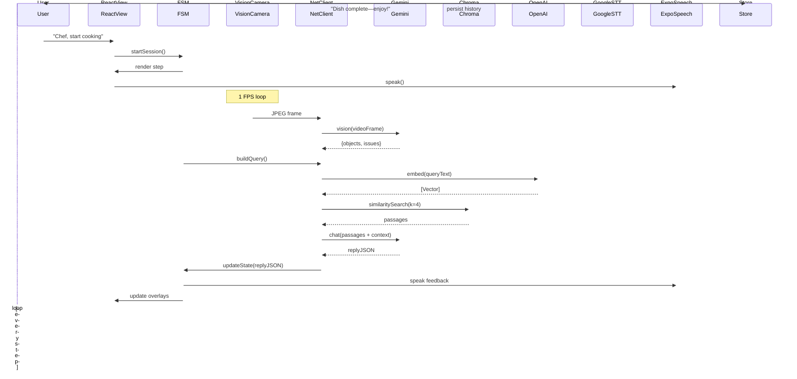

# Engineering Feature Document

**Miso AI — iOS Cooking Assistant (React Native + Expo Edition)**
Date: 2025‑06‑23 | Author: (Your Name)

---

## 0  Summary

| Section                                  | Purpose                                            |
| ---------------------------------------- | -------------------------------------------------- |
| **1. Objective**                         | What we are building and why                       |
| **2. Context**                           | Relationship to the Product Design Doc             |
| **3. High‑Level Architecture**           | Text + Mermaid flow & sequence diagrams            |
| **4. Source Layout (Mono‑repo)**         | Folder tree, package targets, responsibilities     |
| **5. Component Responsibilities & APIs** | Public interfaces for each module                  |
| **6. Control Flow**                      | Step‑by‑step interaction during a cooking session  |
| **7. Implementation Roadmap**            | Milestones, tickets, and sequencing                |
| **8. Tech‑Stack Choices**                | Rationale for every framework / service            |
| **9. Risks & Open Questions**            | What still needs definition                        |
| **10. Next‑Step Clarifications**         | Targeted questions for the PM/Design/Backend teams |

---

## 1  Objective

> **Deliver a functional iOS application that turns any modern iPhone into a hands‑free, AI‑powered cooking coach, implemented with React Native + Expo, using Gemini 2.5 Pro’s *video* (1 FPS) vision, Retrieval‑Augmented Generation (RAG) via ChromaDB, and OpenAI embedding API for recipe documents.**

The first public milestone is **v0.8 Beta (October 2025)** with these user‑facing capabilities:

1. Pick a built‑in or imported recipe
2. Position phone; start guided session
3. Receive continuous audio steps, 1 FPS vision feedback, wake‑word commands
4. End session; view history log (local, on‑device)

---

## 2  Context

* Product Design Doc (PDD) is approved and locks **features, UX, and monetisation**.
* This Engineering Feature Document (EFD) converts PDD goals into **code structure, interfaces, and a sprint‑oriented plan** for a *React Native‑first* team (Expo managed workflow).
* Scope matches the **Gemini‑only / no on‑device ML training** revision and a **single subscription tier**.

---

## 3  High‑Level Architecture

### 3.1 Component Blocks

```mermaid
flowchart TD
    subgraph On‑Device (React Native + Expo)
        AppUI[React Components<br/>(Expo Router)]
        VoiceIO[Voice I/O<br/>(Wake‑Word, STT, TTS)]
        SessionSM[Recipe State Machine<br/>(JS FSM)]
        Camera[VisionCamera @1 FPS]
        NetClient[API Client<br/>(Gemini & Chroma)]
        Store[SQLite / MMKV<br/>User History]
    end
    subgraph Cloud
        Gemini[Gemini 2.5 Pro<br/>(Video+Chat+Embeddings)]
        Chroma[ChromaDB<br/>Vector Search]
        OpenAI[OpenAI Embeddings<br/>(Recipes)]
        Speech[Google STT v3]
    end
    AppUI --dispatch--> SessionSM
    Camera --> NetClient
    VoiceIO --> Speech
    VoiceIO <-- Speech
    NetClient --frames--> Gemini
    NetClient --embed(recipe)--> OpenAI
    NetClient --query--> Chroma
    Gemini --grounded answer--> NetClient
    NetClient --> SessionSM
    SessionSM --> AppUI & VoiceIO
    Store <-- SessionSM
```

**Key React‑Native bindings**

| Native Capability           | RN Module / Expo Plugin                          |
| --------------------------- | ------------------------------------------------ |
| 1 FPS Video Frames          | `react-native-vision-camera` + `expo-camera`     |
| AR‑like overlays (optional) | `expo-gl`, `expo-three`, or `@react-three/fiber` |
| Wake‑word detection         | `@picovoice/react-native-porcupine`              |
| Streaming Speech‑to‑Text    | gRPC → Google STT via `react-native-webrtc`      |
| System TTS                  | `expo-speech`                                    |
| Local DB                    | `expo-sqlite` or `react-native-mmkv`             |

### 3.2 Session Sequence (happy path)



---

## 4  Repository Layout (Mono‑repo)

We keep a single codebase managed by **Expo**, **TypeScript**, and **EAS Build**.

```
miso-ai/
├─ app/                         # Expo Router (screens)
│  ├─ (home)/                   # /            – recipe list
│  ├─ (session)/                # /session     – cooking session
│  └─ (paywall)/                # /paywall     – subscription
├─ src/
│  ├─ components/               # Reusable UI parts
│  ├─ features/
│  │   ├─ cooking-session/
│  │   │    ├─ CameraFeed.tsx
│  │   │    ├─ SessionOverlay.tsx
│  │   │    └─ fsm/             # finite‑state machine
│  │   ├─ recipe-browser/
│  │   └─ subscription/
│  ├─ services/
│  │   ├─ gemini.ts
│  │   ├─ chroma.ts
│  │   ├─ openai.ts
│  │   ├─ voice/
│  │   │    ├─ wakeWord.ts
│  │   │    ├─ sttStream.ts
│  │   │    └─ tts.ts
│  │   └─ storage/
│  │        └─ historyStore.ts
│  ├─ utils/
│  │   ├─ constants.ts
│  │   └─ helpers.ts
│  └─ hooks/
│       └─ useSessionFSM.ts
├─ tests/
│  ├─ unit/
│  └─ e2e/
├─ package.json
├─ tsconfig.json
└─ app.config.ts                 # Expo app‑json in TS
```

**Folder rationale**

| Folder            | Contains                              | Notes                                |
| ----------------- | ------------------------------------- | ------------------------------------ |
| **app/**          | *Route‑centric* screens (Expo Router) | Keeps navigation separate from logic |
| **src/features/** | Feature isolation (Domain > UI)       | Easier chunking for new devs         |
| **src/services/** | Pure logic / API wrappers             | No React imports ⇒ clean testing     |
| **tests/**        | Jest + Detox (E2E)                    | CI‑friendly                          |

---

## 5  Component Responsibilities & Public Interfaces (TypeScript)

| Component            | Key Types (public)                                                                       | Core Responsibility                            |
| -------------------- | ---------------------------------------------------------------------------------------- | ---------------------------------------------- |
| **SessionFSM**       | `start()`, `onVision(frame)`, `onVoice(cmd)`, `currentStep`, `events$` (RxJS Observable) | Deterministic driver of the session            |
| **GeminiClient**     | `analyzeVideoFrame(blob): Promise<VisionResult>`<br/>`chat(payload): Promise<ChatReply>` | All Gemini REST calls with throttl‑ing & retry |
| **ChromaClient**     | `query(vector: number[], k: number): Promise<Passage[]>`                                 | Vector similarity search                       |
| **OpenAIEmbeddings** | `embed(text: string[]): Promise<number[][]>`                                             | Embedding for recipes                          |
| **WakeWordService**  | `onWakeWord$ : Observable<void>`                                                         | Emits when hot‑word detected                   |
| **STTStream**        | `start(): AsyncIterable<string>`                                                         | Mic ↔ Google STT streaming                     |
| **TTSService**       | `speak(text: string): Promise<void>`                                                     | Expo Speech wrapper                            |
| **HistoryStore**     | `save(session)`, `list(): Promise<Session[]>`, `delete(id)`                              | Persist cooking logs                           |

All services are **framework‑agnostic** and produce *RxJS* streams; React hooks subscribe and bind to UI.

---

## 6  Control Flow in Code Terms

1. `useSessionFSM().startSession(recipeId)`
2. `VisionCamera` delivers 1 FPS frames → `GeminiClient.analyzeVideoFrame`
3. Vision result & current step → `buildQuery()`
4. `OpenAIEmbeddings.embed` → `ChromaClient.query`
5. `GeminiClient.chat` with passages + vision context
6. FSM processes reply and pushes *overlay state* & *speech queue* via `events$`
7. React component renders overlay canvas; `TTSService` speaks in background

---

## 7  Implementation Roadmap

| #  | Story / Task                                                               | Outcome                               |
| -- | -------------------------------------------------------------------------- | ------------------------------------- |
| 1  | **Init Expo project** – TS, EAS config, Expo Router                        | App boots to blank screen             |
| 2  | **VisionCamera 1 FPS pipeline** – frame → JPEG blob                        | FrameObservable emitting `Blob`       |
| 3  | **Gemini Vision** – REST wrapper, API keys, basic model types              | Returns dummy `{objects:[]}`          |
| 4  | **Overlay rendering** – `expo-gl` + `@react-three/fiber` or Canvas         | Draw static bounding box              |
| 5  | **Recipe importer** – parse local JSON / PDF → call OpenAI embeddings      | Recipes embedded & cached             |
| 6  | **FSM skeleton** – manual “Next” button                                    | Dry run without vision                |
| 7  | **Voice I/O** – Porcupine wake‑word + Google STT; Expo Speech TTS          | Voice triggers “next”                 |
| 8  | **ChromaDB MVP** – docker compose local; `chroma.ts` search client         | CLI test passes                       |
| 9  | **Wire RAG loop** – QueryBuilder → embeddings → Chroma → chat              | Grounded answer returned              |
| 10 | **Session screen integration** – overlays + voice feedback                 | End‑to‑end happy path                 |
| 11 | **Subscription gating** – Expo In‑App‑Purchases or RevenueCat React Native | Paywall blocks session                |
| 12 | **Beta hardening** – error states, offline fallback, battery profiling     | Meets NFR targets                     |
| 13 | **CI/CD** – GitHub Actions + EAS Build + Expo OTA                          | Nightly builds to internal TestFlight |

---

## 8  Tech‑Stack Choices

| Layer                | Tool / Framework                                        | Why                                                   |
| -------------------- | ------------------------------------------------------- | ----------------------------------------------------- |
| **Language & UI**    | TypeScript 5 + React Native 0.74 (Expo SDK 51)          | Fast dev loop, OTA, one codebase                      |
| **Navigation**       | Expo Router 3                                           | File‑system routing, SSR‑style OTP                    |
| **Camera & Vision**  | `react-native-vision-camera` + JSI + Hermes engine      | 60 FPS preview, 1 FPS capture                         |
| **3D/AR Overlays**   | `expo-gl` + `@react-three/fiber` (or fallback Canvas)   | Lightweight, no native Xcode edits                    |
| **State & Streams**  | RxJS 8 + Zustand (simple stores)                        | Predictable, FRP‑friendly                             |
| **Persistence**      | `react-native-mmkv` (key‑value) + `expo-sqlite`         | On‑device, no iCloud sync                             |
| **AI Services**      | Gemini 2.5 Pro (video, chat, embeddings) (REST)         | Multimodal, single vendor                             |
| **Vector DB**        | ChromaDB on AWS Fargate (HNSW, cosine)                  | Open‑source, serverless‑ish scaling                   |
| **Recipe Embedding** | OpenAI Embedding v3 (text‑only)                         | Accuracy, cost, Python pre‑processing pipeline        |
| **Voice**            | Porcupine (wake‑word), Google STT v3 (stream), Expo TTS | No local ASR model, native TTS OK                     |
| **Payments**         | Expo IAP (StoreKit2) OR RevenueCat SDK                  | Swift in native plug‑in but abstracted by Expo config |
| **CI/CD**            | GitHub Actions → EAS Build → TestFlight                 | Fully managed build farm, OTA pushes                  |

---

## 9  Risks & Mitigations

| Risk                                         | Likelihood | Impact | Mitigation                                                     |
| -------------------------------------------- | ---------- | ------ | -------------------------------------------------------------- |
| Bridge performance (1 FPS frame JS → native) | M          | M      | JSI frame buffers, run encoding in native worklet              |
| Gemini API latency spikes                    | M          | H      | Prefetch next step, stream partial TTS                         |
| STT mis‑recognition in noisy kitchen         | M          | M      | Wake‑word fallback, confirm destructive commands               |
| ChromaDB ops complexity                      | L          | M      | ≤ 50 k docs, Fargate autoscale, nightly backups                |
| Battery drain / thermal throttling           | M          | M      | 1 FPS cap, reduce frame rez, pause when device face‑down       |
| Expo → Native escape‑hatch needs             | H          | M      | Keep detaching option (pre‑eject plan), isolate native modules |
| First‑time RN dev ramp‑up                    | H          | M      | Expo managed workflow, sample code, pair programming           |

---

## 10  Next‑Step Clarifications

1. **Wake‑word engine** – OK to ship with tap‑to‑talk MVP and add hot‑word post‑launch? **✔ Yes**
2. **Subscription backend** – RevenueCat vs. own receipt server? **✔ RevenueCat confirmed**
3. **Image privacy** – Any in‑region inference (EU)? **✔ Not required for now**
4. **Smart‑appliance control** – In scope for v1.0? **✔ Post‑launch**
5. **Brand voice** – Custom TTS vs. system voices? **✔ System voices for now**

*Please flag any other constraints (e.g., Expo Go vs. custom dev client, minimum iOS version) before sprint kick‑off.*

---

### End of Document

All original insights are retained, re‑mapped to a **React Native + Expo** ecosystem, and the proposed stack is production‑viable for an iOS‑first launch.
